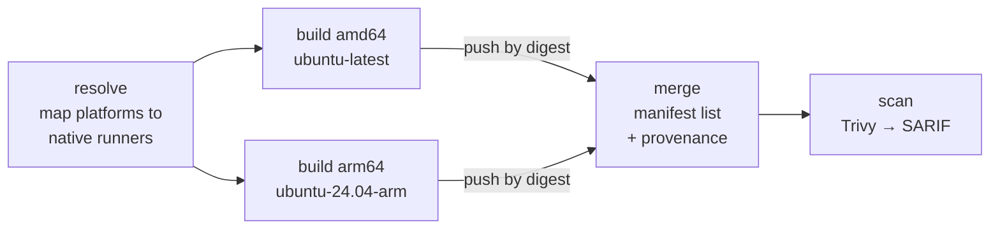

# docker-builds

Multi-architecture container images for security tooling, published to GitHub
Container Registry.

[](https://github.com/matusso/docker-builds/actions/workflows/ci.yml)
[](#image-catalog)
[](https://github.com/matusso?tab=packages)
[](LICENSE)

Many good security tools ship no container image, ship an `amd64`-only image, or
ship one that has gone stale. This repository fills that gap: it builds them on
a pinned schedule, for both `linux/amd64` and `linux/arm64`, with signed build
provenance and a vulnerability scan on every publish.

---

## Quick start

```bash
docker pull ghcr.io/matusso/wafw00f:latest
docker run --rm ghcr.io/matusso/wafw00f:latest https://example.com
```

Every image resolves to the right architecture automatically — the tag is a
multi-arch manifest, so the same command works on an Apple Silicon laptop and an
`x86_64` server.

More examples:

```bash
# Fingerprint a WAF
docker run --rm ghcr.io/matusso/wafw00f:v2.4.2 https://example.com

# Brute-force web paths
docker run --rm ghcr.io/matusso/dirsearch:v0.4.4 -u https://example.com

# Run PocketBase, persisting data to a named volume
docker run --rm -p 8080:8080 -v pb_data:/pb/pb_data ghcr.io/matusso/pocketbase:latest

# Analyse firmware in the current directory
docker run --rm -v "$PWD:/work" ghcr.io/matusso/binwalk:latest /work/firmware.bin

# MVT exposes two CLIs, so the image starts a shell
docker run --rm -it ghcr.io/matusso/mvt:latest
```

---

## Image catalog

All images are published as `ghcr.io/matusso/<image>` for `linux/amd64` and
`linux/arm64`.

| Image | Version | Upstream | Built from |
| --- | --- | --- | --- |
| `binwalk` | `v3.1.0` | [ReFirmLabs/binwalk](https://github.com/ReFirmLabs/binwalk) | upstream Dockerfile |
| `dirsearch` | `v0.4.4` | [maurosoria/dirsearch](https://github.com/maurosoria/dirsearch) | upstream Dockerfile |
| `ghauri` | `1.4.3` | [r0oth3x49/ghauri](https://github.com/r0oth3x49/ghauri) | [`files/ghauri`](files/ghauri) |
| `kiterunner` | `v1.0.2` | [assetnote/kiterunner](https://github.com/assetnote/kiterunner) | [`files/kiterunner`](files/kiterunner) |
| `metasploit-framework` | `6.5.0` | [rapid7/metasploit-framework](https://github.com/rapid7/metasploit-framework) | upstream Dockerfile |
| `mvt` | `v2026.7.29` | [mvt-project/mvt](https://github.com/mvt-project/mvt) | [`files/mvt`](files/mvt) |
| `pocketbase` | `v0.39.10` | [pocketbase/pocketbase](https://github.com/pocketbase/pocketbase) | [`files/pocketbase`](files/pocketbase) |
| `raptor` | `sha-<commit>` | [gadievron/raptor](https://github.com/gadievron/raptor) | upstream devcontainer Dockerfile |
| `routersploit` | `v3.4.7` | [threat9/routersploit](https://github.com/threat9/routersploit) | [`files/routersploit`](files/routersploit) |
| `wafw00f` | `v2.4.2` | [EnableSecurity/wafw00f](https://github.com/EnableSecurity/wafw00f) | [`files/wafw00f`](files/wafw00f) |

### Per-image notes

- **`pocketbase`** listens on `8080`, stores data in `/pb/pb_data`, and defines a
  `HEALTHCHECK` against `/api/health`. Mount a volume at `/pb/pb_data` to persist
  data.
- **`mvt`** installs two entrypoints, `mvt-ios` and `mvt-android`, so the image
  defaults to a shell rather than choosing one for you.
- **`routersploit`** starts the interactive `rsf.py` console; run it with `-it`.
- **`raptor`** is a development-environment image, not a minimal runtime. It
  tracks upstream's default branch rather than a release, so it is tagged
  `sha-<commit>` plus `latest`. On `arm64` the bundled CodeQL CLI is replaced by
  a stub that explains why — GitHub publishes CodeQL CLI binaries for `linux64`
  only.
- **`metasploit-framework`** uses upstream's entrypoint, which provisions a
  matching host user and expects a database. Follow
  [upstream's Docker instructions](https://github.com/rapid7/metasploit-framework/tree/master/docker).

### Also published: a custom Caddy binary

Not an image — a GitHub Release. [Caddy](https://github.com/caddyserver/caddy)
`v2.11.4` built with `github.com/caddy-dns/cloudflare` compiled in, for
`linux-amd64`, `linux-arm64` and `linux-armv7`.

```bash
gh release download caddy-v2.11.4 --repo matusso/docker-builds --pattern '*linux-amd64*'
sha256sum -c SHA256SUMS --ignore-missing
```

---

## Verifying what you pull

Every published manifest carries a signed build provenance attestation tying it
to the exact workflow run and commit that produced it.

```bash
gh attestation verify oci://ghcr.io/matusso/wafw00f:latest --owner matusso
```

To pin an exact image rather than a moving tag, resolve the digest once and use
it everywhere:

```bash
docker buildx imagetools inspect ghcr.io/matusso/wafw00f:v2.4.2 --format '{{.Manifest.Digest}}'
docker run --rm ghcr.io/matusso/wafw00f@sha256:<digest> --help
```

---

## Tagging policy

| Tag | Meaning |
| --- | --- |
| `<version>` | The upstream release this image packages, for example `v2.4.2`. Immutable in practice — a rebuild of the same upstream version overwrites it only if the build inputs changed. |
| `latest` | The most recent build of the newest pinned version. |
| `sha-<commit>` | Used only by `raptor`, which tracks a branch rather than releases. |

There are no per-architecture tags. Each architecture is built on a native
runner and pushed **by digest**; only the multi-arch manifest gets tagged. This
replaced an earlier scheme that published `-amd64` and `-arm64` tags as build
intermediates.

---

## Running as a non-root user

Every image we build ourselves runs as uid/gid `10001` and works in `/work`
(`/pb` for PocketBase, `/data` for kiterunner). That is the right default, but it
means writes to a bind-mounted host directory fail unless the host directory is
writable by that uid.

Two ways to handle it:

```bash
# Match the container user to yours
docker run --rm --user "$(id -u):$(id -g)" -v "$PWD:/work" ghcr.io/matusso/ghauri:latest ...

# Or make the mount writable by uid 10001
mkdir -p out && chown 10001:10001 out
docker run --rm -v "$PWD/out:/work" ghcr.io/matusso/ghauri:latest ...
```

Images built from an upstream Dockerfile use whatever user upstream chose.

---

## How the pipeline works

One reusable workflow, [`_build-image.yml`](.github/workflows/_build-image.yml),
does the work. Each tool has a small caller workflow that supplies its name,
version, build context and smoke test.



- **Native runners, no emulation.** `amd64` builds on `ubuntu-latest`, `arm64` on
  `ubuntu-24.04-arm`. Nothing runs under QEMU.
- **Smoke tested per architecture.** Each build runs the image's entrypoint and
  asserts on the result before the manifest is published. A broken `arm64` build
  cannot reach `latest`.
- **Pull requests build but never push.** A PR gets the full two-architecture
  build and both smoke tests with publishing disabled.
- **Scanned on publish.** Trivy results go to GitHub code scanning. Findings are
  reported rather than enforced; see [SECURITY.md](SECURITY.md#scanning-is-reported-not-enforced).

A caller workflow in full:

```yaml
jobs:
  image:
    uses: ./.github/workflows/_build-image.yml
    permissions:
      contents: read
      packages: write
      security-events: write
      id-token: write
      attestations: write
    with:
      image: wafw00f
      version: v2.4.2
      context: files/wafw00f
      description: Web application firewall fingerprinting toolkit
      licenses: BSD-3-Clause
      push: ${{ github.event_name != 'pull_request' }}
      smoke-command: docker run --rm "$IMAGE" --help | grep -qi 'usage'
```

### Repository layout

```
.github/workflows/
  _build-image.yml     Reusable build → merge → scan pipeline
  _sonar-scan.yml      Reusable SonarCloud scan of an upstream source tree
  ci.yml               Linters, Trivy config scan, and the test suite
  <tool>.yml           One thin caller per published image
files/<image>/
  Dockerfile           Images we build ourselves, all on one template
scripts/
  catalog.py                   Reads the repo's declared state; defines "consistent"
  check_catalog.py             Dependency-free CLI over the above
  patch_raptor_dockerfile.py   Declarative CI patches for RAPTOR's Dockerfile
tests/                 Conventions, supply-chain rules, and catalog consistency
```

### Testing

Two layers, deliberately split:

| Layer | What it proves | Where |
| --- | --- | --- |
| `pytest` | The repository's declared state is coherent — Dockerfiles follow one template, workflows keep their supply-chain guarantees, the RAPTOR patcher behaves, and the README catalog matches every workflow pin | `ci.yml`, every push and pull request |
| Smoke tests | The built image actually runs, on each architecture separately | `_build-image.yml`, before any manifest is published |

The first layer exists because "all images follow the same format" and "the docs
match reality" are only true while something checks them. Run it with
`pytest -rs`; see [CONTRIBUTING.md](CONTRIBUTING.md#tests).

---

## Maintaining

Bumping a version is a two-line change — the workflow's `version:` input and the
catalog table above. Dependabot handles base images and action versions weekly.

See [CONTRIBUTING.md](CONTRIBUTING.md) for the Dockerfile conventions, how to add
a new image, and the local lint commands.

## Security

Supply-chain posture, scanning policy and how to report a vulnerability are in
[SECURITY.md](SECURITY.md).

These images package penetration testing and forensics tooling. Use them only
against systems you are authorised to test.

## Licensing

Two separate things, and conflating them is the usual mistake:

**This repository** — the workflows, Dockerfiles, scripts and tests — is
[Apache-2.0](LICENSE). All of it is original work; no upstream source is vendored
here.

**The published images** are a different matter. Each one contains a third-party
tool under that tool's own license, and those terms travel with the image
regardless of this repository's license. If you redistribute an image, you take
on its upstream obligations — two of them are copyleft:

| Image | Upstream license |
| --- | --- |
| `kiterunner` | AGPL-3.0-only |
| `dirsearch` | GPL-2.0-or-later |
| `mvt` | MVT License 1.1 — Mozilla-derived, **not** OSI-approved, and it restricts use |
| `metasploit-framework`, `routersploit`, `wafw00f` | BSD-3-Clause |
| `binwalk`, `ghauri`, `pocketbase`, `raptor` | MIT |
| `caddy` (binary release) | Apache-2.0 |

One extra caveat for `raptor`: on `linux/amd64` the image bundles GitHub's
**CodeQL CLI**, which is not covered by RAPTOR's MIT licence and is distributed
under [GitHub's own terms](https://github.com/github/codeql-cli-binaries), which
restrict what you may use it for. Upstream flags this too. The `arm64` image
contains no CodeQL binary at all, so the restriction does not apply there.

Every image records this in its `org.opencontainers.image.licenses` label, so you
can check what you have without consulting this table:

```bash
docker buildx imagetools inspect ghcr.io/matusso/kiterunner:latest \
  --format '{{json .Image}}' | jq -r '.config.Labels["org.opencontainers.image.licenses"]'
```
